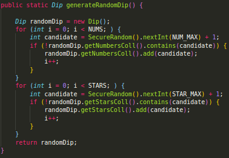
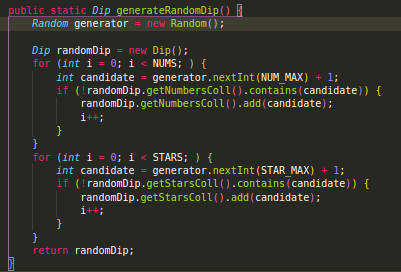

Ao correr:

```bash
mvn clean verify sonar:sonar   
-Dsonar.projectKey=lab06_2euromilhoes   
-Dsonar.host.url=http://localhost:9000   
-Dsonar.login=4e24dbfbf45c49274059789f7aca62a8e9feba1d
```

Obtivemos:


| Issue              | Problem Description                                          | How to solve                                                 |
| ------------------ | ------------------------------------------------------------ | ------------------------------------------------------------ |
| Bug                | Creating a new `Random` object each time a random value is needed is inefficient and may produce numbers which are not random depending on the JDK | For better efficiency and randomness, you can create a single `Random`, store it, and reuse it. (*images below*) |
| Vulnerability      | *nothing found*                                              |                                                              |
| Code Smell - Info  | Remove this 'public' modifier                                | Remove it                                                    |
| Code Smell - Minor | Reorder the modifiers to comply with the Java Language Specification. | Reorder `static public` to `public static` (in this specific case) |
| Code Smell - Major | Replace this use of `System.out` or `System.err` by a logger. | Replace it                                                   |


#### Bug

*Before*																						*After*




#### **Code Smell**

Some code smells found by *sonarqube*


After fixing:


