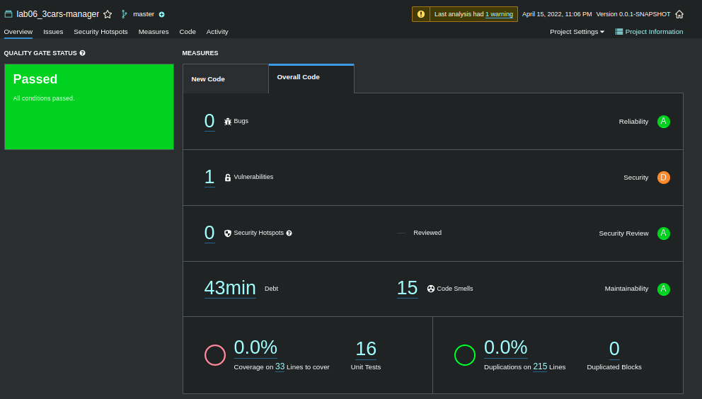
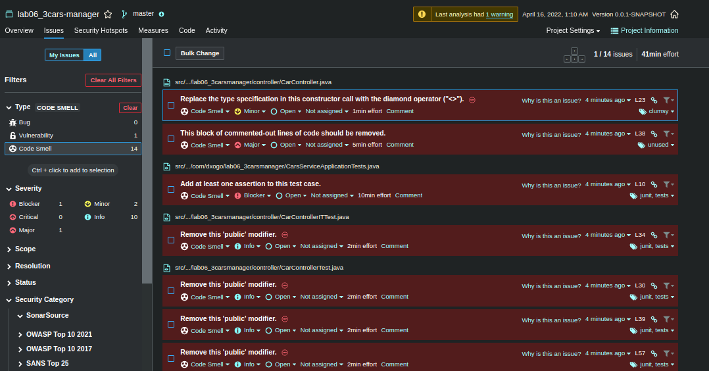
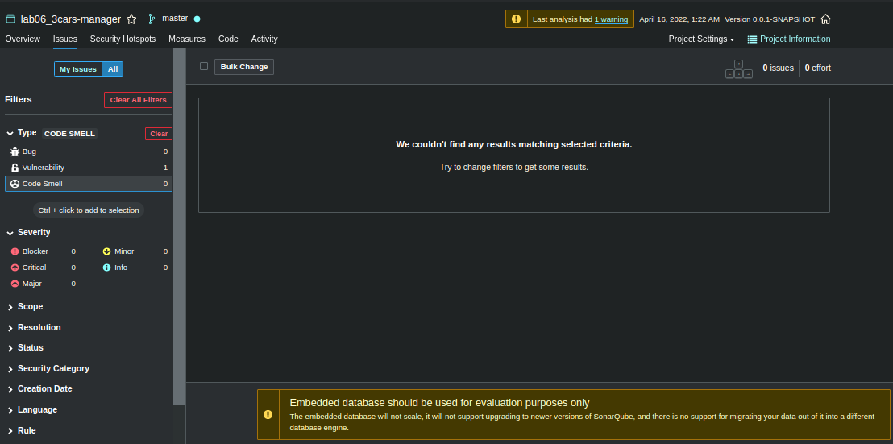

Ao correr:

```bash
mvn clean verify sonar:sonar   
-Dsonar.projectKey=lab06_3carsmanager   
-Dsonar.host.url=http://127.0.0.1:9000   
-Dsonar.login=9d5b2636c831099e9b446b49a075601aae438adb
```

Obtivemos:




| Issue                    | Problem Description                                          | How to solve                                          |
| ------------------------ | ------------------------------------------------------------ | ----------------------------------------------------- |
| Bug                      | *nothing found*                                              |                                                       |
| Vulnerability - Critical | Replace this persistent entity with a simple POJO or DTO object. | Replace it                                            |
| Code Smell - Info        | Remove this 'public' modifier.                               | Remove it                                             |
| Code Smell - Minor       | Replace the type specification in this constructor call with the diamond operator ("<>"). | Replace `ResponseEntity<Car>` with `ResponseEntity<>` |
| Code Smell - Major       | This block of commented-out lines of code should be removed. | Remove commented code                                 |
| Code Smell - Blocker     | Add at least one assertion to this test case.                | Add one assertion                                     |


#### **Code Smell**

Some code smells found by *sonarqube*




After fixing:

